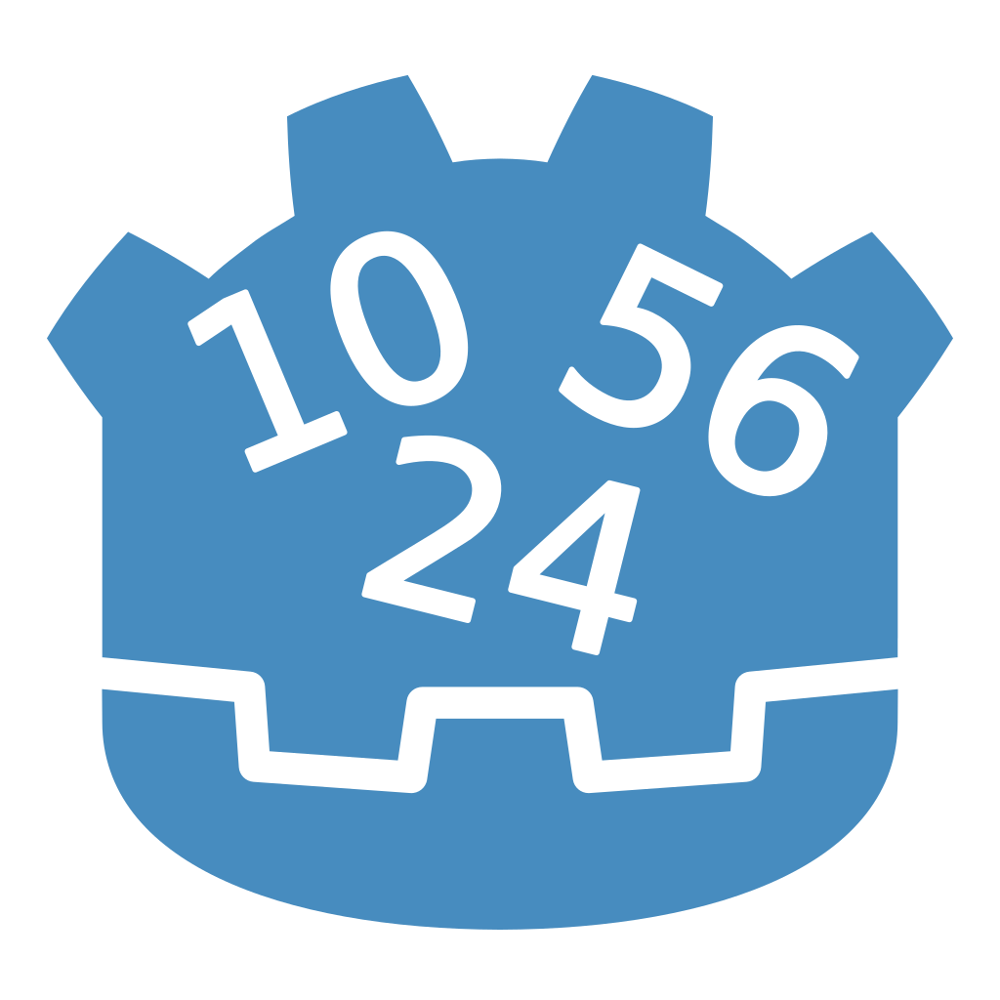
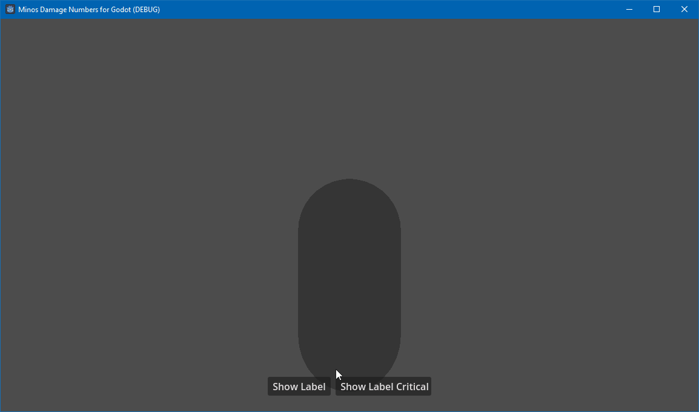

# [Minos Damage Numbers](https://minosdamagenumbers.carrd.co) for Godot

Damage numbers UI similar to what is seen in roguelikes using object pooling for the [Godot Engine](https://godotengine.org/).

*NOTE: This is for Godot 4 only, and this repo is for GDScript, C# version coming soon!*

## Features

- Easily add support for showing off damage numbers
- Change color of text based on the type of damage
- Uses object pooling for better efficiency!
- Supports both 2D and 3D!

## Installation

Copy the `minos_damage_numbers` directory into your `res://addons/directory`. Then make sure to enable the plugin in `Project Settings -> Plugins`. For C# projects make sure to remember to build! The autoloads should automatically appear, but in case they don't make sure to add them by calling them `MinosDamageNumbers2D` and `MinosDamageNumbers3D`.

## Documentation

- [Github Ver](Documentation.md)
- [Website Ver](https://minosdamagenumbers.carrd.co/#docs)

## Contributors

Minos Damage Numbers for Godot is made by [Minoqi](https://freelancefelix.com).

## License

Licensed under the MIT license, see `LICENSE` for more information.
